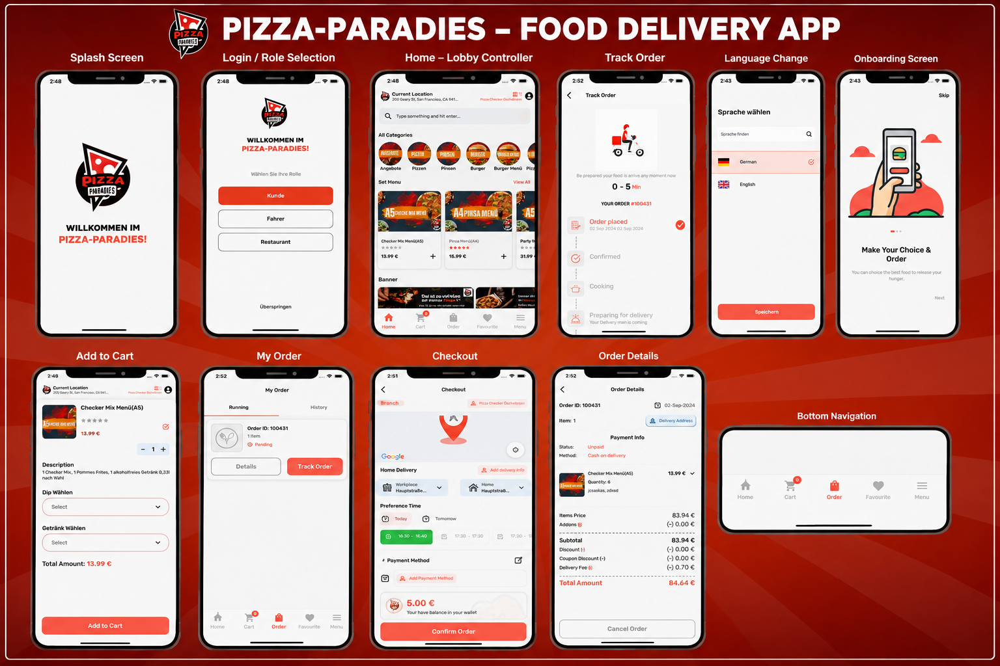

# 🍕 Pizza Checker - User App

Pizza Checker is a Flutter-based food ordering application that allows users to بسهولة order their favorite pizzas, track deliveries in real-time, and receive instant updates.

---

## 📱 App Screenshots
Main Page 


## 🚀 Features

- 🍔 Browse food items & pizza menu
- 🛒 Add to cart & place orders
- 📍 Real-time order tracking
- 🔔 Push notifications (order updates, offers)
- 💳 Easy checkout process
- 👤 User profile management
- 📦 Order history
- 🔍 Search & filter food items

## 📱 App Flow

1. User signs up / logs in  
2. Browses menu & selects items  
3. Adds items to cart  
4. Places order  
5. Tracks order in real-time  
6. Receives delivery  

## 🛠️ Tech Stack

- Flutter (Dart)
- Firebase Authentication
- Cloud Firestore
- Firebase Cloud Messaging (FCM)
- Google Maps API

## 📂 Project Structure

```
lib/
│── models/
│── screens/
│── widgets/
│── services/
│── utils/


## 🔑 Requirements

- Flutter SDK
- Android Studio / VS Code
- Firebase configured project


## 👨‍💻 Developer

Adnan Malik  
Flutter Developer

---

⭐ If you like this project, don’t forget to star the repo!
